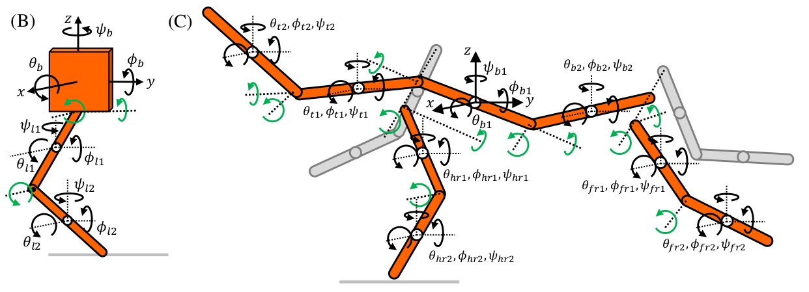

# `import physical_education as pe`
A library to help:
* model robots and animals which run around and _do cool stuff_
* run trajectory optimization to understand those models
* animate and plot the results

It's for research into legged critters

## Example:

Let's model a monoped hopper, shown in the left on this diagram:



(The complicated quadruped model on the right is where this library starts to shine)

We'll use a rotary joint for the hip (connection between upper link and body) and Hooke's joint for the knee (connection between upper link and lower link), shown in the following diagram:


On to the code:

```python
import physical_education as pe

base = pe.links.Link3D(
    'base', '+x', base=True,
    mass=5., radius=0.4, length=0.4,
)

upper = pe.links.Link3D(
    'upper', '-z', start_I=base.Pb_I,
    mass=.6, radius=0.01, length=0.25,
)

lower = pe.links.Link3D(
    'lower', '-z', start_I=upper.bottom_I,
    mass=.4, radius=0.01, length=0.25,
)

# use an 8-sided polygon for the friction model
pe.foot.add_foot(lower, at='bottom',
                 nsides=8, friction_coeff=1.)

# add relationships between links
# the base has two degrees of freedom with respect
# to the thigh - like a human's hip
base.add_hookes_joint(upper, about='xy')
pe.motor.add_torque(
    base, upper, about='xy',
    torque_bounds=(-2., 2.), no_load_speed=20,
)

# the thigh has one degree of freedom with respect
# to the calf - like a human's knee
upper.add_revolute_joint(lower, about='y')
pe.motor.add_torque(
    upper, lower, about='y',
    torque_bounds=(-2., 2.), no_load_speed=20,
)

# combine into a robot
robot = pe.system.System3D(
    '3D monoped',
    [base, upper, lower],
)

# calculate the equations of motion of the robot
# symbolically, then lambdify them into a regular
# python function
# we'll also simplify the equations in parallel, using 8 cores
robot.calc_eom(
    simp_func = lambda x: pe.utils.parsimp(x, nprocs=8),
)

# create a pyomo model
# we'll discretize the problem into 50 finite elements,
# use implicit euler for integration, and give a base total
# time of 1 second whilst allowing individual finite elements
# to vary by 20%
robot.make_pyomo_model(
    nfe=50, collocation='implicit_euler',
    total_time=1.0, vary_timestep_within=(0.8, 1.2),
)

# let's start with a drop test
# we'll have to write some code, but the idea is that this
# library gives you the tools + example code to complete a
# task. It doesn't have all tasks built in - that's what your
# research is about!
initial_height = 3.0  # meters

nfe = len(robot.m.fe)
ncp = len(robot.m.cp)
body = robot['base']

# start at the origin
body['q'][1, ncp, 'x'].fix(0)
body['q'][1, ncp, 'y'].fix(0)
body['q'][1, ncp, 'z'].fix(initial_height)

# fix initial angle
for link in robot.links:
    for ang in ('phi', 'theta', 'psi'):
        link['q'][1, ncp, ang].fix(0)

# start stationary
for link in robot.links:
    for q in link.pyomo_sets['q_set']:
        link['dq'][1, ncp, q].fix(0)

# initialize to the y plane
for link in robot.links:
    for ang in ('phi', 'theta', 'psi'):
        link['q'][:, :, ang].value = 0

# knee slightly bent at the end
ang = 0.01
upper['q'][nfe, ncp, 'theta'].setlb(ang)
lower['q'][nfe, ncp, 'theta'].setub(-ang)

# but not properly fallen over
body['q'][nfe, ncp, 'z'].setlb(0.2)

# objective: reduce foot penalty (more on that later!)
pen_cost = pe.foot.feet_penalty(robot)
robot.m.cost = Objective(expr=1000*pen_cost)

# solve!
# this assumes you have IPOPT installed, along with
# linear solver HSL MA86
pe.utils.default_solver(
    max_mins=10, solver='ma86'
    OF_hessian_approximation='limited-memory'
).solve(robot.m, tee=True)

# check final penalty value, and so on
robot.post_solve(costs)

# animate the result at 1/3 speed
robot.animate(view_along=(35, -120), t_scale=3)
```

## Getting started

1. Decide on a python implementation

   Larger models benefit tremendously from using [PyPy](https://www.pypy.org/) instead of [CPython](https://www.python.org/downloads/) as your python implementation. If you want more clarity on the differences, read [this explanation](https://stackoverflow.com/questions/17130975/python-vs-cpython#17130986). Anecdotally, PyPy is at least twice as fast when simplifying large models using sympy, and twenty times as fast when setting up models using pyomo. That's the difference of 30 seconds vs 10 minutes!

2. Install a nonlinear optimizer, like IPOPT

   ... which is at times much easier said than done. Instructions are [here](https://github.com/coin-or/Ipopt#getting-started). You'll also need to install a linear solver. The HSL solvers are the best for many tasks, and their multi-core MA86 solver in particular is very fast. There's [a page](http://www.hsl.rl.ac.uk/ipopt/) about HSL + Ipopt, which you should read. This step is usually far easier when done in a Unix environment, like [Ubuntu](https://ubuntu.com/) and others like it

3. Install `physical_education`. It's recommended that you use a virtual environment - whether that's [conda](https://docs.conda.io/en/latest/), [venv](https://docs.python.org/3/tutorial/venv.html), [poetry](https://python-poetry.org/) or whatever else seems easiest to you

   ```bash
   python -m pip install physical_education
   ```

4. Optional, but highly recommended: install [jupyterlab](https://jupyterlab.readthedocs.io/)

   Jupyterlab is the current version of the Jupyter IDE, which is used to view and run jupyter notebooks. Alex will shamelessly plug his [guide](https://alknemeyer.github.io/remote-notebooks/) on a good setup for this, if you have two computers: a laptop which you want to work on, and a beefy computer where you want optimizations to run

5. Look through examples, and then start your project. Good luck, and please raise an issue if anything is unclear
